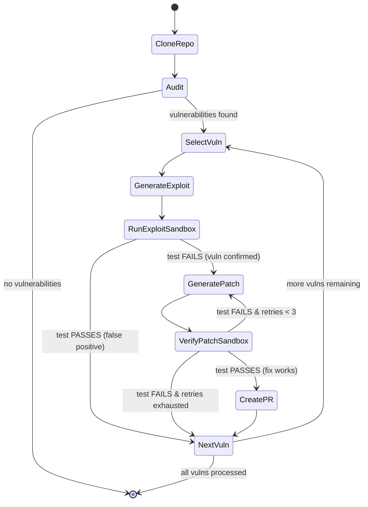

# Architecture — Autonomous Multi-Agent Code Auditor

## System Overview

The system operates as a **stateful directed graph** orchestrated via **LangGraph**, where individual nodes represent specialized AI agents or sandboxed execution environments, and edges manage state transitions, conditional routing, and self-healing retry loops.

## State Machine Diagram



## Agent Descriptions

### 1. Auditor Agent (`auditor.py`)
- **Purpose**: Performs static security analysis on all Python source files
- **Input**: `source_files` (dict of file paths to content)
- **Output**: `vulnerabilities` (list of structured vulnerability objects)
- **LLM**: GPT-4o with temperature=0 for deterministic analysis
- **Categories**: SQL injection, command injection, path traversal, unsafe deserialization, XSS, missing auth, hardcoded secrets

### 2. Exploit Agent (`exploit.py`)
- **Purpose**: Generates a minimal pytest unit test that reproduces a specific vulnerability
- **Input**: `current_vuln` (single vulnerability object with source code context)
- **Output**: `exploit_test_code` (Python pytest code)
- **Design**: Test must FAIL when vulnerability exists, PASS when fixed

### 3. Patch Agent (`patcher.py`)
- **Purpose**: Generates a fixed version of the vulnerable source file
- **Input**: `current_vuln`, original source code, previous sandbox errors (for self-healing)
- **Output**: `patch_code` (complete fixed file content)
- **Self-Healing**: On retry, receives previous `sandbox_stderr` to diagnose and correct the fix

### 4. PR Creator (`pr_creator.py`)
- **Purpose**: Creates a GitHub Pull Request with the verified fix
- **Input**: `patch_code`, `exploit_test_code`, vulnerability metadata
- **Output**: `pr_url`
- **PR Body**: Includes vulnerability summary, severity, affected file/lines, reproduction test, and patch description

## Docker Sandbox Architecture

```
┌─────────────────────────────────────────────┐
│               Host Machine                  │
│                                             │
│  ┌──────────────┐    ┌───────────────────┐  │
│  │ LangGraph    │───>│  Temp Directory   │  │
│  │ Pipeline     │    │  - source files   │  │
│  │              │    │  - test_exploit.py │  │
│  └──────────────┘    └────────┬──────────┘  │
│                               │ bind mount  │
│  ┌────────────────────────────┴──────────┐  │
│  │        Docker Container               │  │
│  │  Image: python:3.11-slim             │  │
│  │  Network: disabled                    │  │
│  │  Memory: 512MB limit                  │  │
│  │  Timeout: 30 seconds                  │  │
│  │                                       │  │
│  │  /workspace/                          │  │
│  │    ├── source files...                │  │
│  │    └── test_exploit.py                │  │
│  │                                       │  │
│  │  $ python -m pytest test_exploit.py   │  │
│  │                                       │  │
│  │  stdout/stderr ──> captured           │  │
│  │  exit_code ──> returned               │  │
│  └───────────────────────────────────────┘  │
│         ↓ auto-removed after execution      │
└─────────────────────────────────────────────┘
```

### Safety Guarantees
- **Network isolation**: `network_mode="none"` prevents data exfiltration
- **Resource limits**: 512MB memory ceiling prevents memory bombs
- **Execution timeout**: 30-second hard timeout prevents infinite loops
- **Ephemeral containers**: Auto-removed after every execution
- **Temp directory cleanup**: `shutil.rmtree()` in `finally` block

## Self-Healing Retry Loop

```
Patch Agent generates fix
        │
        ▼
Sandbox runs exploit test with patch applied
        │
        ├── EXIT CODE 0 (test passes) ──> Fix verified! Create PR
        │
        └── EXIT CODE != 0 (test fails)
                │
                ├── attempts < 3 ──> Feed stderr back to Patch Agent (retry)
                │
                └── attempts >= 3 ──> Give up, move to next vulnerability
```

## Data Flow

| State Key | Set By | Used By |
|-----------|--------|---------|
| `source_files` | CloneRepo | Auditor, ExploitSandbox, VerifySandbox |
| `vulnerabilities` | Auditor | SelectVuln, routing |
| `current_vuln` | SelectVuln | Exploit, Patcher, PRCreator |
| `exploit_test_code` | Exploit | ExploitSandbox, VerifySandbox |
| `patch_code` | Patcher | VerifySandbox, PRCreator |
| `sandbox_exit_code` | Sandbox nodes | Routing decisions |
| `sandbox_stderr` | Sandbox nodes | Patcher (self-healing) |
| `patch_attempts` | SelectVuln, Patcher | Routing (retry limit) |
| `pr_urls` | PRCreator | Final output (accumulated) |
| `event_log` | All nodes | Observability (accumulated) |
