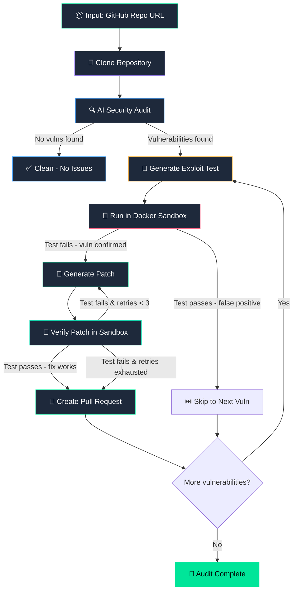
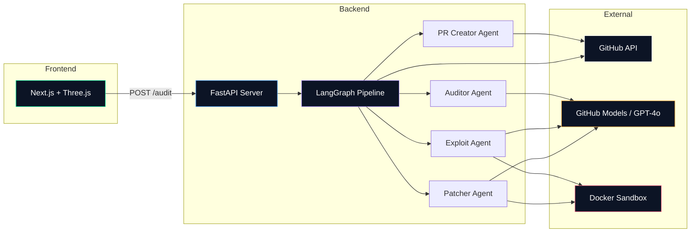
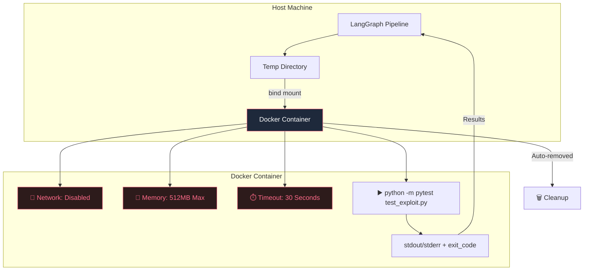

# 🛡️ PatchForge — Autonomous Security Auditor & Auto-Patcher

An autonomous multi-agent pipeline that scans a GitHub repository for security vulnerabilities, reproduces them with failing tests in Docker sandboxes, generates patches, verifies fixes, and opens Pull Requests — all without human intervention.

🔗 **Live Demo:** [patchforge-app.vercel.app](https://patchforge-app.vercel.app)

```
[GitHub Repo] ──> [Auditor Agent] ──> [Exploit Agent] ──> [Docker Sandbox Test]
                                                                  │
[GitHub Pull Request] <── [Verify Fix] <── [Patch Agent] <────────┘
```

## 🔄 Pipeline Flow



## 🧬 Architecture Diagram



## 🔐 Docker Sandbox Architecture



## 🚀 Features

- **Zero False-Positive PRs** — Only opens Pull Requests for security fixes verified by passing tests in clean sandboxes
- **Autonomous Remediation Loop** — Scans → Reproduces → Fixes → Verifies → Submits PRs automatically
- **Safe Execution** — All generated code runs inside network-isolated, resource-constrained Docker containers
- **Self-Healing** — If a patch fails verification, the system feeds errors back to the Patch Agent (up to 3 retries)
- **MCP Integration** — GitHub operations exposed via Model Context Protocol for modular tool access
- **Web Dashboard** — Real-time pipeline visualization with cybersecurity-themed dark UI

## 📋 Prerequisites

- **Python 3.11+**
- **Node.js 18+** (for the frontend)
- **Docker Desktop** installed and running
- **GitHub Personal Access Token** with `repo` scope
- **OpenAI API Key** (GPT-4o)

## ⚡ Quick Start

### Step 1: Clone the Repository

```bash
git clone https://github.com/asheth2310/code-auditor.git
cd code-auditor
```

### Step 2: Install Python Backend

```bash
pip install -e ".[dev]"
```

### Step 3: Configure Environment Variables

```bash
cp .env.example .env
```

Open `.env` and fill in your credentials:

```env
GITHUB_TOKEN=ghp_your_github_token_here
OPENAI_API_KEY=sk-your_openai_key_here
DOCKER_IMAGE=python:3.11-slim
SANDBOX_TIMEOUT=30
MAX_PATCH_RETRIES=3
```

**Where to get the keys:**
- **GitHub Token:** Go to [github.com/settings/tokens](https://github.com/settings/tokens) → Generate new token (classic) → Select `repo` scope
- **OpenAI API Key:** Go to [platform.openai.com/api-keys](https://platform.openai.com/api-keys) → Create new secret key

### Step 4: Make Sure Docker is Running

```bash
docker --version
# Should output something like: Docker version 24.x.x
```

If Docker Desktop isn't running, start it before proceeding.

### Step 5: Run the Auditor (CLI Mode)

```bash
python -m code_auditor.main --repo owner/repo-name --verbose
```

Replace `owner/repo-name` with any GitHub repository you want to audit (e.g., `your-username/your-project`).

### Example Output

```
============================================================
  Autonomous Code Auditor & Auto-Patcher
  Target: owner/repo-name
============================================================

[Auditor] Found 4 vulnerabilities in 3 files
[SelectVuln] Processing vuln 1/4: sql_injection in app.py
[ExploitSandbox] exit_code=1, status=completed
[VerifySandbox] exit_code=0, status=completed, attempt=1
[PRCreator] Opened PR: https://github.com/owner/repo/pull/42

============================================================
  AUDIT COMPLETE
============================================================
  Vulnerabilities found: 4
  Pull Requests opened:  4
```

Those PR links will be **real GitHub Pull Requests** on the target repository with the fix and exploit test included.

---

## 🖥️ Frontend (Web Dashboard)

The project includes a Next.js web dashboard for visualizing the audit pipeline.

### Running the Frontend Locally

```bash
cd frontend
npm install
npm run dev
```

Open [http://localhost:3000](http://localhost:3000) in your browser.

> **Note:** The frontend currently shows a demo simulation. To connect it to the real backend, a FastAPI server needs to be added (coming soon).

### Tech Stack (Frontend)

| Component | Technology |
|-----------|-----------|
| Framework | Next.js 16 (App Router) |
| Styling | Tailwind CSS |
| Icons | Lucide React |
| Typography | Fira Code + Inter |
| Hosting | Vercel |

---

## 🏗️ Backend Tech Stack

| Component | Technology |
|-----------|-----------|
| Orchestration | LangGraph (Stateful multi-agent graphs) |
| LLM | OpenAI GPT-4o |
| Protocol | Model Context Protocol (MCP) + FastMCP |
| Sandboxing | Docker SDK for Python (docker-py) |
| Testing | pytest |
| GitHub API | PyGithub |
| Configuration | Pydantic Settings |

---

## 🧠 How It Works

### Pipeline Flow

1. **Clone** — Clones the target GitHub repository and reads all Python files
2. **Audit** — GPT-4o analyzes the codebase for 7 vulnerability categories:
   - SQL Injection
   - Command Injection
   - Path Traversal
   - Unsafe Deserialization
   - Cross-Site Scripting (XSS)
   - Missing Authentication
   - Hardcoded Secrets
3. **Exploit** — For each vulnerability, generates a minimal pytest test that proves the bug exists
4. **Sandbox Test** — Runs the exploit test in an isolated Docker container (no network, 512MB RAM, 30s timeout)
5. **Patch** — If the exploit confirms the vulnerability, GPT-4o generates a fixed version of the file
6. **Verify** — Runs the exploit test again with the patched code — the test should now PASS
7. **Self-Heal** — If verification fails, feeds the error back to the patcher (up to 3 retries)
8. **Create PR** — If the fix is verified, creates a GitHub Pull Request with the patch + exploit test

### Safety Guarantees

- Network isolation (`network_mode="none"`) — prevents data exfiltration
- Memory limits (512MB) — prevents memory bombs
- Execution timeout (30s) — prevents infinite loops
- Ephemeral containers — auto-removed after every execution
- Temp directory cleanup — always cleaned up in `finally` block

---

## 📁 Project Structure

```
code-auditor/
├── .env.example                  # Environment template
├── pyproject.toml                # Python project config
├── requirements.txt
├── Dockerfile.sandbox
├── src/code_auditor/
│   ├── config.py                 # Pydantic Settings
│   ├── state.py                  # LangGraph state schema
│   ├── sandbox.py                # Docker sandbox execution
│   ├── github_service.py         # GitHub API (clone, branch, commit, PR)
│   ├── main.py                   # CLI entrypoint
│   ├── mcp_server.py             # FastMCP server
│   └── agents/
│       ├── auditor.py            # Security scanner (GPT-4o)
│       ├── exploit.py            # Exploit test generator
│       ├── patcher.py            # Code fix generator
│       ├── pr_creator.py         # PR creator
│       └── graph.py              # LangGraph pipeline
├── frontend/                     # Next.js web dashboard
│   ├── app/
│   │   ├── components/           # React components
│   │   ├── lib/                  # Types, utils, mock data
│   │   ├── page.tsx              # Main page
│   │   └── layout.tsx            # Root layout
│   └── package.json
├── examples/
│   └── vulnerable_app/
│       └── app.py                # Sample vulnerable app
└── tests/
    └── __init__.py
```

---

## 🧪 Testing with the Sample Vulnerable App

The `examples/vulnerable_app/app.py` contains intentionally vulnerable code for testing:

| Vulnerability | Function | Type |
|--------------|----------|------|
| SQL Injection | `get_user()` | String concatenation in SQL |
| Command Injection | `run_command()` | Unsanitized `os.system()` |
| Path Traversal | `read_file()` | Unvalidated file paths |
| Unsafe Deserialization | `load_config()` | `yaml.load()` without SafeLoader |

---

## 🔧 MCP Server

Start the MCP server to expose GitHub tools:

```bash
python -m code_auditor.mcp_server
```

---

## ❓ FAQ

**Q: The PR links in the demo show 404?**
A: The live demo at [frontend-six-nu-98.vercel.app](https://frontend-six-nu-98.vercel.app) uses simulated/mock data. The PR links point to fake repositories. To get real PRs, run the Python backend locally against a real repo you own.

**Q: Can I audit any public repository?**
A: Yes, as long as your GitHub token has access. For private repos, the token needs `repo` scope on that specific repo.

**Q: Is it safe to run?**
A: Yes. All generated exploit code runs inside isolated Docker containers with no network access, limited memory, and automatic cleanup. Nothing runs on your host machine directly.

**Q: What languages does it support?**
A: Currently Python files only (`.py`). Support for more languages can be added by extending the auditor agent's prompts.

---

## 📄 License

MIT
